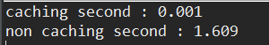
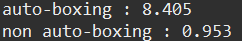

# Effective Java 2장 객체 생성과 파괴


## Item 1. 생성자 대신 정적 팩토리 메소드를 고려하라.

클래스에서 인스턴스를 얻는 전통적인 수단은 public 생성자를 이용하는 방식이다.

하지만 public 생성자를 대신하거나 함께 정적 팩토리 메소드를 제공할 수 있다.


### 정적 팩토리 메소드를 사용할 때의 장점


#### 1. 이름을 가질 수 있다.

생성자와 생성자에서 사용되는 파라미터로는 반환될 객체에 대해서 제대로 설명하기 어렵다. 

아래에 코드를 보면

```java
class Book {
    private String title;

    public Book() {
    }

    public Book(String title) {
        this.title = title;
    }

    public static Book withTitle(String title) {
        return new Book(title);
    }

    public static void main(String[] args) {
        Book book1 = new Book();
        Book book2 = Book.withTitle("Effective Java");
    }
}
```

Book이라는 생성자를 이용한 book1이라는 객체보다 팩토리 메소드를 이용하게 되면 코드를 좀 더 직관적으로 쉽게 파악이 가능하다.


생성자는 같은 타입의 파라미터를 받는 생성자를 두 개 이상 만들 수 없지만 팩토리 메소드를 이용하면 가능하다.

```java
class Book {
    private String title;
    private String author;
    
    public Book() {
    }

    public Book(String title) {
        this.title = title;
    }
    
    public Book(String author){
        this.author = author;
    }
}
```


이런 식의 생성자를 사용하게 되면 같은 시그니처를 사용하기에 생성자 사용이 불가능하다. 물론 다른 타입의 파라미터로 이루어진 경우 아래와 같이 사용은 가능하지만 이는 좋지 못한 방식이다.

```java
class Book {
    private String title;
    private String author;
    private int page;
    
    public Book() {
    }

    public Book(String title, int page) {
        this.title = title;
        this.page = page;
    }

    public Book(int page, String title) {
        this.title = title;
        this.page = page;
    }
}
```


이러한 경우 아래와 같이 코드를 작성하면 사용이 가능하다.

```java
class Book {
    private String title;
    private String author;

    public Book() {
    }

    public Book(String title) {
        this.title = title;
    }

    public static Book withTitle(String title) {
        return new Book(title);
    }

    public static Book withAuthor(String author) {
        Book book = new Book();
        book.author = author;
        return book;
    }

    public static void main(String[] args) {
        Book book1 = new Book();
        Book book2 = Book.withTitle("Effective Java");
        Book book3 = Book.withAuthor("Joshua Bloch");
    }
}
```


정적 팩토리 메소드가 무조건적으로 좋은 경우는 아니지만 한 클래스에 시그니처가 같은 생성자가 여러 개가 필요할 경우에는 유용하게 사용이 가능하다.


#### 2. 호출될 때 마다 인스턴스를 새로 생성하지 않아도 된다.

- 객체를 생성하지 않기 때문에 코스트가 높은 객체가 자주 요청되는 상황에서 성능을 끌어올릴 수 있다.

  - 플라이웨이트 패턴(Flyweight Pattern)과 비슷하다고 볼 수 있다.

    > 플라이웨이트 패턴(참고자료)
    >
    > https://ko.wikipedia.org/wiki/%ED%94%8C%EB%9D%BC%EC%9D%B4%EC%9B%A8%EC%9D%B4%ED%8A%B8_%ED%8C%A8%ED%84%B4

**인스턴스 통제** - 언제 어떤 인스턴스를 살아있게 할지 인스턴스의 생명주기를 통제

- 클래스를 싱글톤, 인스턴스화 불가로 만들 수 있다.
- 불변 값 클래스에서 동치인 인스턴스가 단 하나임을 보장한다.


#### 3. 반환 타입의 하위 타입 객체를 반환할 수 있다.

반환할 객체의 클래스를 자유롭게 선택할 수 있어 클래스의 유연성이 생겨, API를 만들 때 구현 클래스를 공개하지 않고 객체를 반환이 가능하다. 즉, API 사용을 위해 익혀야 하는 개념이 줄어들어 편의성을 제공하게 된다.

**자바 8 이전**에는 인터페이스에 정적 메소드를 선언할  수 없었다. 따라서 인터페이스를 반환하는 정적 메소드를 필요로 하게되면 인스턴스화 불가한 동반 클래스를 만들어서 그 안에 정의해야 했다.

하지만 자바 8버전부터는 인터페이스가 정적 메소드를 가질 수 없다는 제한이 풀려서 동반 클래스를 둘 필요가 없어졌다.

- 굳이 별도의 문서를 찾아가며 구현 클래스가 무엇인지 알아보지 않아도 된다.

  ※ **자바 8**에서 인터페이스는 public 정적 멤버만 허용하고, **자바 9**에서는private 정적메소드까지 허용한다

  - 정적 필드와 정적 멤버 플래스는 public이어야 한다.


#### 4. 입력 매개변수에 따라 매번 다른 클래스의 객체를 반환할 수 있다.

반환 타입의 하위 타입이기만 하면 어떤 클래스의 객체를 반환하든 상관없다. 심지어 다른 클래스가 객체를 반환해도 된다.

책에 예시로 나온 EnumSet 클래스 같은 경우 클라이언트는 내부에 두 클래스의 존재를 모르지만 원소의 수에 따라 원소가 64개 이하이면 **RegularEnumSet**을 반환하고, 64개를 초과하면 **JumboEnumSet** 을 반환한다.

```java
public static <E extends Enum<E>> EnumSet<E> noneOf(Class<E> elementType) {
        Enum<?>[] universe = getUniverse(elementType);
        if (universe == null)
            throw new ClassCastException(elementType + " not an enum");
        if (universe.length <= 64)
            return new RegularEnumSet<>(elementType, universe);
        else
            return new JumboEnumSet<>(elementType, universe);
}
```


#### 5. 정적 팩토리 메소드를 작성하는 시점에 반환할 객체의 클래스가 존재하지 않아도 된다.

이러한 유연함 덕에 서비스 제공자 프레임워크를 만들 수 있다.

서비스 제공자 프레임워크의 구성요소

- 3개의 핵심 컴포넌트
  - `서비스 인터페이스` : 구현체의 동작을 정의
  - `서비스 등록 API` : 제공자가 구현체를 등록할 때 사용
  - `서비스 접근 API` : 클라이언트가 서비스의 인스턴스를 얻을 때 사용
- 종종 사용되는 네 번째 컴포넌트
  - `서비스 제공자 인터페이스` : 서비스 인터페이스의 인스턴스를 생성하는 팩토리 객체


클라이언트는 **서비스 접근 API**를 이용해서 원하는 구현체를 가져올 수 있다.

- 조건을 명시하지 않을 경우 기본 구현체 혹은 지원하는 구현체들을 돌아가며 반환한다.이러한 서비스 접근 API가 서비스 제공자 프레임워크의 근간인 유여한 정적 팩토리 메소드의 실체다. 


서비스 제공자 인터페이스가 없다면 리플렉션을 이용해서 구현체를 인스턴스화 역할을 수행하도록 한다.

- 예시 : JDBC

  - ```java
    Class.forName("oracle.jdbc.driver.OracleDriver"); 
    Connection conn = null; 
    conn = DriverManager.getConnection("jdbc:oracle:thin:@localhost:1521:ORA92", "scott", "tiger"); 
    ```

  - `DriverManager.registerDriver` : 제공자 등록 API 역할(oracle, mysql ...)

  - `Connection ` :  서비스 인터페이스 역할

  - `DriverManager.getConnection ` : 서비스 접근 API 역할

  - `Driver` : 서비스 제공자 인터페이스 역할

  

------


### 정적 팩토리 메소드의 단점


#### 1. 상속하기 위해서 public이나 protected 생성자가 필요하기 때문에 정적 팩토리 메소드만 제공하면  하위 클래스를 만들 수 없다.

책에서 언급한 java.util.Collections 로 만든 구현체는 상속할 수 없다.


#### 2. 프로그래머가 찾기 어렵다.

생성자처럼 JavaDoc에서 따로 모아주는 기능이 존재하지 않기 때문에 API 문서를 잘 정리하지 않으면 개발자가 의미를 정확히 알기 어렵다.

따라서 널리 알려진 규약에 따라 짓는 방식으로 이러한 문제점을 보완해야 한다.

아래는 책에서 알려준 흔한 명명방식이다.

- `from `: 매개변수 하나로 하나의 인스턴스 만듬
- `of `: 여러 매개변수로 인스턴스 만듬
- `valueOf `: from 과 of의 자세한 버전
- `getInstance`, `instance `: 인스턴스를 반환(매개변수가 없는 경우 같은 인스턴스임을 보장하지 않음)
- `create`, `newInstance` : 매번 새로운 인스턴스를 생성하여 반환(같은 인스턴스임을 보장)
- `getType ` , `newType`: 인스턴스를 생성할 때, 해당 클래스가 아닌 다른 클래스에서 생성할 때 사용
- `Type `: `getType`, `newType `의 간략한 버전

------


### 정적 팩토리 메소드의 단점


#### 1. 상속하기 위해서 public이나 protected 생성자가 필요하기 때문에 정적 팩토리 메소드만 제공하면  하위 클래스를 만들 수 없다.

책에서 언급한 java.util.Collections 로 만든 구현체는 상속할 수 없다.


#### 2. 프로그래머가 찾기 어렵다.

생성자처럼 JavaDoc에서 따로 모아주는 기능이 존재하지 않기 때문에 API 문서를 잘 정리하지 않으면 개발자가 의미를 정확히 알기 어렵다.

따라서 널리 알려진 규약에 따라 짓는 방식으로 이러한 문제점을 보완해야 한다.

아래는 책에서 알려준 흔한 명명방식이다.

- `from `: 매개변수 하나로 하나의 인스턴스 만듬
- `of `: 여러 매개변수로 인스턴스 만듬
- `valueOf `: from 과 of의 자세한 버전
- `getInstance`, `instance `: 인스턴스를 반환(매개변수가 없는 경우 같은 인스턴스임을 보장하지 않음)
- `create`, `newInstance` : 매번 새로운 인스턴스를 생성하여 반환(같은 인스턴스임을 보장)
- `getType ` , `newType`: 인스턴스를 생성할 때, 해당 클래스가 아닌 다른 클래스에서 생성할 때 사용
- `Type `: `getType`, `newType `의 간략한 버전

------


## Item2. 생성자에 매개변수가 많다면 빌더를 고려하라

매개변수가 많은 클래스가 있을 경우의 3가지 코드를 예시로 들어보겠다.


#### 점층적 생성자 패턴

`점층적 생성자 패턴`은 가장 단순한 패턴으로 필수로 들어가야하는 파라미터를 포함한 생성자와 선택적으로 필요한 파라미터를 포함하는 생성자를 각각 만들어주는 것이다.

```java
public class item2 {

    private int required1;
    private int required2;
    private int required3;
    private int optional1;
    private int optional2;

    public item2(int required1, int required2, int required3) {
        this.required1 = required1;
        this.required2 = required2;
        this.required3 = required3;
    }

    public item2(int required1, int required2, int optional1, int required3) {
        this.required1 = required1;
        this.required2 = required2;
        this.optional1 = optional1;
        this.required3 = required3;
    }

    public item2(int required1, int required2, int optional1, int optional2, int required3) {
        this.required1 = required1;
        this.required2 = required2;
        this.optional1 = optional1;
        this.optional2 = optional2;
        this.required3 = required3;
    }
}
```

점층적 생성자 패턴은 쓰기 가장 간단하지만 **매개변수가 많아지면 코드 작성 및 가독성이 안좋아진다.**

- 각각의 매개변수가 무엇을 뜻하는지, 매개변수를 몇 개 사용했고, 몇 번째 입력중인지 주의깊게 살펴보아야 한다.


#### 자바빈즈 패턴

매개변수가 없는 생성자로 객체를 만들고, `setter`를 이용해서 원하는 매개변수의 값을 설정하는 방식이다.

```java
public class item2 {

    private int required1;
    private int required2;
    private int required3;
    private int optional1;
    private int optional2;

    public item2() {}

    public void setRequired1(int val){
        required1 = val;
    }

    public void setRequired2(int val){
        required2 = val;
    }

    public void setRequired3(int val){
        required3 = val;
    }

    public void setOptional1(int val){
        optional1 = val;
    }

    public void setOptional2(int val){
        optional2 = val;
    }
}

```

코드를 확인해보면 점층적 생성자 패턴의 단점이 사라지고, 가독성 좋은 코드가 생성되었다.


##### 자바빈즈 패턴의 단점

객체 하나를 만들기 위해서 여러 개의 메소드를 호출해야 하고, 객체가 완전히 생성되기 전에는 일관성이 무너진다.

- 생성자를 통한 유효성 검사가 불가능 함.

클래스를 불변으로 만들 수 없다.

※ **불변(immutable)** : 어떠한 변경도 허용하지 않는다는 뜻, 주로 변경을 허용하는 가변 객체와 구분하는 용도


#### 빌더 패턴

필요한 객체를 직접 만드는 대신 **필수 매개변수만으로 생성자를 호출**해 빌더 객체를 얻고, **setter를 이용하여 선택 매개변수를 설정**한다. 그 이후 매개변수가 없는 build 메소드를 호출해 필요한 객체를 얻는다.(보통은 일관성을 위한 불변 객체)

```java
public class Item2 {

    private final int required1;
    private final int required2;
    private final int required3;
    private final int optional1;
    private final int optional2;

    public static class Builder {
        //필수 매개변수
        private final int required1;
        private final int required2;
        private final int required3;

        //옵션 매개변수
        private int optional1 = 0;
        private int optional2 = 0;

        public Builder(int required1, int required2, int required3) {
            this.required1 = required1;
            this.required2 = required2;
            this.required3 = required3;
        }

        public Builder optional1(int val) {
            optional1 = val;
            return this;
        }

        public Builder optional2(int val) {
            optional2 = val;
            return this;
        }
        public Item2 build(){
            return new Item2(this);    
        }
    }

        private Item2(Builder builder) {
            required1 = builder.required1;
            required2 = builder.required2;
            required3 = builder.required3;
            optional1 = builder.optional1;
            optional2 = builder.optional2;
        }
}
```

Item2 라는 클래스는 분변이고, 필수 및 선택적 매개변수들을 한 곳에 모아두었기 때문에 setter를 통해서 필요한 매개변수를 호출할 수 있다. 이러한 방식을 `fluent API` 또는 `method chaining`이라고 한다.

- 사용 예시

  - ```java
    Item2 item = new Builder(1, 2, 3)
        .optional1(1)
        .optional2(2)
        .build();
    ```

빌더 패턴은 **쉽고**, **가독성이 좋다.** 이는 `명명된 선택적 매개변수(named optional parameters)`를 모사한 것이다.


빌더 패턴은 계층적으로 설계된 클래스와 쓰기 좋은데 추상클래스는 추상 빌더를, 구현 클래스는 구현 빌더를 가지도록 하여 이를 상속하는 클래스들에서 다양한 계층구조의 빌더 패턴을 확인할 수 있다.


책의 예시 코드를 보면 Pizza, NyPizza, Calzone 코드로 예시를 설명하고 있다.

- pizza.java

  - ```java
    import java.util.EnumSet;
    import java.util.Objects;
    import java.util.Set;
    
    public abstract class Pizza {
        public enum Topping {HAM, MUSHROOM, ONION, PEPPER, SAUSAGE}
    
        final Set<Topping> toppings;
    
        abstract static class Builder<T extends Builder<T>> {
            EnumSet<Topping> toppings = EnumSet.noneOf(Topping.class);
    
            public T addTopping(Topping topping) {
                toppings.add(Objects.requireNonNull(topping));
                return self();
            }
    
            abstract Pizza build();
    
            protected abstract T self();
        }
    
        Pizza(Builder<?> builder) {
            toppings = builder.toppings.clone();
        }
    }
    ```

    여기서 추상 메소드인 **self()**를 사용하여 하위 클래스에서 따로 형변환 없이 메소드 연쇄를 지원한다.

    - 이러한 방식을 `시뮬레이트한 셀프타입(simulated self-type)` 이라고 한다.

- NyPizza.java

  - ```java
    public class NyPizza extends Pizza {
        public enum Size {SMALL, MEDIUM, LARGE}
    
        private final Size size;
    
        public static class Builder extends Pizza.Builder<Builder> {
            private final Size size;
    
            public Builder(Size size) {
                this.size = size;
            }
    
            @Override
            NyPizza build() {
                return new NyPizza(this);
            }
    
            @Override
            protected Builder self() {
                return this;
            }
        }
    
        private NyPizza(Builder builder) {
            super(builder);
            size = builder.size;
        }
    }
    ```

- Calzone.java

  - ```java
    public class Calzone extends Pizza {
        private final boolean sauceInside;
    
        public static class Builder extends Pizza.Builder<Builder> {
            private boolean sauceInside = false;
    
            public Builder sauceInside() {
                this.sauceInside = true;
                return this;
            }
    
            @Override
            Calzone build() {
                return new Calzone(this);
            }
    
            @Override
            protected Builder self() {
                return this;
            }
        }
    
        private Calzone(Builder builder) {
            super(builder);
            this.sauceInside = builder.sauceInside;
        }
    }
    ```

각각 하위 클래스인 `NyPizza.java`와 `Calzone.java`의 빌더가 정의한 build 메소드는 해당하는 구현 하위 클래스인 NyPizza와 Calzone을 반환한다.

이 케이스처럼 **하위 클래스의 메소드가 상위의 메소드가 정의한 반환 타입이 아니라 그 하위 타입을 반환하는 기능**을 `공변 반환 타이핑(covariant return typing)` 이라 한다. 이 기능을 사용하면 클라이언트가 형변환에 신경쓰지 않아도 된다.


##### 빌더 패턴의 단점

객체를 만들려면 빌더를 만들어야 하고, 이렇게 코드의 양이 증가하게 되면 성능이 민감한 상황에서 코스트가 커지는 상황이 발생할 수 있다.

또한 매개변수가 적을 경우에는 점층적 생성자 패턴이 더 효율적일 수 있다. 하지만 시스템을 장기적으로 운영/유지보수 하게되면 매개변수가 추가되는 경우가 많고, 이러한 경우에 점층적 생성자 패턴을 이용하여 빌드 패턴으로 전환하는 공수가 또 들기 때문에 애초에 빌더 패턴을 이용하는 편이 낫다.

------


## Item 3. private 생성자나 열거 타입으로 싱글톤임을 보증하라.

#### 싱글톤

- 인스턴스를 **오직 하나만** 생성할 수 있는 클래스
- 무상태 객체(stateless Object)
- 시스템 컴포넌트
- DB Connection Pool 등

클래스를 싱글턴으로 만들면 이를 사용하는 클라이언트를 테스트하기 어려워질 수 있다. 타입을 인터페이스로 정의한 다음 그 인터페이스를 구현해 만든 싱글턴이 아니라면 싱글턴 인스턴스를 가짜 구현(mock)으로 대체할 수 없기 때문이다.


### 싱글톤 생성 방식

#### 1. public static final을 이용한 방식

```java
public class Book {
		public static final Book INSTANCE = new Book();
		private Book(){}
		
		public void borrowBook(){}
}
```

public, protected 생성자가 없기 때문에 Book.INSTANCE를 초기화 할 때만 호출되어 인스턴스가 전체 시스템에서 하나 뿐임이 보장된다.

예외적으로 권한이 있는 클라이언트는 리플렉션 API인 `AccessibleObject.setAccessible`을 사용해 private 생성자를 호출할 수 있다. 이러한 공격을 방지하고자 한다면, 생성자에서 두 번 객체를 생성하려고 할 때 예외를 던지게 하면 된다.

**※ 리플렉션 API**

- 리플렉션은 런타임에 클래스의 런타임 동작을 검사하거나 수정하는 프로세스이다.

- 리플렉션 API는 IDE나 디버거, 테스트 툴 등에서 사용된다.

  > https://docs.oracle.com/javase/tutorial/reflect/
  >
  > https://www.javatpoint.com/java-reflection

또한 코드를 간결하게 볼 수 있다.


#### 2. 정적 팩토리 방식

```java
public class Book {
	private static final Book INSTANCE = new Book();
	private Book(){}
		
	public static Book getInstance(){
        return INSTANCE; 
    }
    
    public void borrowBook(){}
}
```

첫 번째 만든 방식과 같이 여기서도 getInstance에서 항상 같은 객체의 참조를 반환하기 때문에 리플렉션을 제외하고는 또 다른 Book이라는 인스턴스를 만들 수 없다.

정적 팩토리 방식의 장점은 API를 변경하지 않고도 getInstance를 변경하여 싱글톤이 아니게 변경이 가능하다.

또한 정적 팩토리를 `제네릭 싱글톤 팩토리`로 만들 수 있고, 정적 팩토리의 메소드 참조를 `공급자(Supplier<>)`로 사용할 수 있다.


싱글톤 클래스를 1번과 2번 방식으로 `직렬화`하기 위해서는 모든 인스턴스 필드를 `일시적(transient)`라고 선언하고 `readResolve`메소드를 제공해야 `역직렬화`시에 새로운 인스턴스가 만들어지는 것을 방지할 수 있다. 만약 이렇게 하지 않으면 초기화해둔 인스턴스가 아닌 다른 인스턴스가 반환된다.

**※ 직렬화(serializable)**

- 자바 시스템 내부에서 사용되는 **객체 또는 데이터를 외부의 자바 시스템에서도 사용할 수 있도록 바이트(byte) 형태로 데이터 변환하는 기술**(`직렬화`)과 **바이트로 변환된 데이터를 다시 객체로 변환하는 기술**(`역직렬화`)을 아우르는 말

  > https://techblog.woowahan.com/2550/
  >
  > https://techblog.woowahan.com/2551/

```java
private Object readResolve(){ 
		return INSTANCE; 
}
```


#### 3. 열거 타입 방식

간결하고 추가적인 노력 없이 직렬화가 가능하다. 또한 아주 복잡한 직렬화 상황이나 리플렉션 공격에 대해서도 다른 인스턴스가 생성되는 것을 막아준다.

대부분의 상황에서는 원소가 하나뿐인 열거타입이 싱글턴을 만드는 가장 좋은 방법이다. 단, 만들려는 싱글턴이 **Enum 외의 클래스를 상속해야 한다면 이 방법은 사용할 수 없다.**

```java
public enum Book{
    INSTANCE;
    
    public void borrowBook(){}
}
```


------


## Item 4. 인스턴스화를 막으려거든 private 생성자를 사용하라.

정적 메소드와 정적 필드만 담은 클래스는 객체지향적이지 않지만 나름의 쓰임은 있다.

- `java.lang.Math`, `java.util.Arrays`와 같이 기본 타입 값이나 배열 관련 메소드를 모아둘 수 있다.
- `java.util.Collections`와 같은 인터페이스 구현 객체를 모아두는 정적 메소드를 모아둘 수 있다.
- final 클래스 관련 메소드들을 모아둘 수 있다.

하지만 이러한 경우 생성자를 명시하지 않으면 컴파일러에서 자동으로 기본 생성자를 생성하여 사용자가 구분이 어렵다.

- 이는 private 생성자를 추가하여 클래스의 인스턴스화를 막으면 된다.


---


## Item 5. 자원을 직접 명시하지 말고 의존 객체 주입을 사용하라.


정적 유틸리티와 싱글톤을 잘못 사용한 예시이다.

```java
//정적 유틸리티
public class SpellChecker{
	private static final Lexicon dictionary;
	private SpellChecker() {}
    
	public static boolean isValid(String word){}
	public static List<String> suggestions(String typo){}
}

//싱글톤
public class SpellChecker{
	private static final Lexicon dictionary;
	private SpellChecker() {} 
	public static SpellChecker INSTANCE = new SpellChecker();

	public static boolean isValid(String word){}
	public static List<String> suggestions(String typo){}
}
```

이 두 코드는 유연하지 않고, 테스트가 어렵다. 그 이유는 아래와 같다.

- 사용할 사전이 단 한 가지라고 생각하고 있다.
- 의존하는 객체를 직접 생성하고 있다.

여기서 dictionary 필드에서 final 한정자를 제거하고 다른 사전으로 교체하는 메소드를 추가하면 여러 사전을 사용할 수 있지만, 오류를 내기 쉽고, 멀티스레드 환경에서는 사용이 불가능하다.

사용하는 자원에 따라 동작이 달라지는 클래스는 정적 유틸리티 클래스나 싱글톤 방식이 적합하지 않다. 이러한 경우에는 클래스가 여러 자원 인스턴스를 지원하고, 클라이언트가 원하는 자원을 사용하도록 해야 한다.

```java
public class SpellChecker{
	private final Lexicon dictionary;
    
	public SpellChecker(Lexicon dictionary){
		this.dictionay = Objects.requiredNonNull(dictionay);
	}
	
    public boolean isValid(String word){}
	public List<String> suggestions(String typo){}
}
```

#### 의존성 객체 주입(dependency injection)

*   필요한 객체를 직접 생성하는 것이 아닌 외부로부터 필요한 객체를 받아서 사용하는 것


##### 의존 객체 주입 패턴의 장점

* 유연하고 테스트가 쉽다.

- 자원의 개수나 의존관계에 상관없이 잘 동작한다.
- 여러 클라이언트가 의존 객체들을 공유 가능하다.


의존 객체 주입은 유연성과 테스트 용이성을 개선해주지만, 의존성이 많은 경우 코드를 어지럽게 할 수 있지만 **의존 객체 주입 프레임워크**인 대거, 주스, 스프링 등을 사용하면 해소 가능하다.

​	ex) 스프링 의존성 주입

* 외부에서 객체를 생성한 후 의존성을 주입시키는 방식으로, 생성자 이용방식, Field 변수 이용방식, setter 이용방식이 있다.


---


## Item 6. 불필요한 객체 생성을 피하라.

똑같은 기능의 객체는 매번 생성하기 보다는 재사용하는 것이 빠르고 효율적이다.

예를 들어서 아래와 같은 객체 생성이 있다고 하자.

```java
String s1 = new String("string");
String s2 = "string";
```

위의 문장은 실행될 때마다 String 인스턴스를 생성하기 때문에 쓸모없는 인스턴스를 여러 번 생성하여 효율적이지 못하다. 그 밑에 작성된 코드는 하나의 인스턴스를 사용하기 때문에 재사용성이 보장된다.

>String interning과 String pooling의 차이
>
>https://ict-nroo.tistory.com/18
>
>https://www.journaldev.com/797/what-is-java-string-pool


또한 생성 비용이 큰 객체의 경우 캐싱을 사용하는 것이 좋다. 여기서 말하는 생성 비용이 비싼 객체란 책에 언급된 **pattern object**나 **크기가 아주 큰 Array**, **Database Connection**, **I/O 작업을 필요로 하는 Object** 등을 말한다.

아래에 간단하게 크기가 큰 배열을 만들어서 캐싱을 할 때와 안 할 때의 속도 비교를 해보았다.

```java
public class Caching {
    private static int[] caching = new int[100000];

    public static void main(String[] args) {
        long beforeTime = System.currentTimeMillis();

        for (int i = 0; i < 50000; i++) {
            caching[i] = 1;
        }
        System.out.println("caching second : " + (float)(System.currentTimeMillis() - beforeTime) / 1000);

        beforeTime = System.currentTimeMillis();

        for (int i = 0; i < 50000; i++) {
            int[] nonCaching = new int[100000];
            nonCaching[i] = 1;
        }
        System.out.println("non caching second : " + (float)(System.currentTimeMillis() - beforeTime) / 1000);
    }
}
```

##### 

대충 어마어마하게 큰 속도차이가 난다는 것을 알 수 있다.


불변 객체인 경우에 안정하게 재사용하는 것이 매우 명확하지만 반대의 경우가 존재하긴 한다. 어댑터(뷰)는 실제 작업은 뒷단에 있는 객체에 위임하고, 본인은 뒷단 객체를 관리만 하면 되기 때문에 뒷단 객체 한 개당 한 개씩만 만들어지면 된다.


#### 오토 박싱

오토 박싱은 불필요한 객체를 만들어내는 또 하나의 예시로 개발자가 기본 타입과 박싱된 기본 타입을 혼용해서 사용하는 경우 자동으로 상호 변환해주는 기술이다. 오토박싱을 통해서 기본타입과 박싱된 기본타입의 구분이 모호해지긴 하지만 **완전히 없애주는 것은 아니다.**

이 또한 자바 코드로 속도를 비교해보았다.

```java
public class AutoBoxing {
  public static void main(String[] args) {
    long beforeTime = System.currentTimeMillis();

    Long sum = 0L;
    for (long i = 0; i <= Integer.MAX_VALUE; i++) {
      sum += i;
    }
    System.out.println("auto-boxing : " + (float)(System.currentTimeMillis() - beforeTime) / 1000);

    beforeTime = System.currentTimeMillis();
    long sum1 = 0L;
    for (long i = 0; i <= Integer.MAX_VALUE; i++) {
      sum1 += i;
    }
    System.out.println("non auto-boxing : " + (float)(System.currentTimeMillis() - beforeTime) / 1000);
  }
}
```

##### 

결과는 대략 9배 정도의 성능차이가 났다. 따라서 오토박싱에서도 비용이 발생하므로 이러한 부분을 주의해서 코드를 작성해야 한다.


---


## Item 7. 다 쓴 객체 참조를 해제하라.

자바는 C/C++과는 다르게 가비지 컬렉터 덕분에 메모리 관리를 따로 안해주어도 된다는 장점이 있다. 하지만 이 또한 메모리를 절대적으로 관리해주는 것은 아니다. 책에 나온 예시 코드이다.

```java
import java.util.Arrays;

public class Stack {
    private Object[] elements;
    private int size = 0;
    private static final int DEFAULT_INITIAL_CAPACITY = 16;

    public Stack() {
        this.elements = new Object[DEFAULT_INITIAL_CAPACITY];
    }

    public Stack(int size) {
        this.elements = new Object[size];
    }

    public void push(final Object e) {
        ensureCapacity();
        elements[size++] = e;
    }

    public Object pop() {
        if (size == 0) {
            return null;
        }
        return elements[--size];
    }

    public Object size() {
        return this.elements.length;
    }

    private void ensureCapacity() {
        if (elements.length == size) {
            elements = Arrays.copyOf(elements, (size * 2) + 1);
        }
    }
}
```

이 코드를 보면 push, pop을 해주면서 따로 누수가 없는 것으로 보이지만, 메모리 누수가 존재한다. 실제로 elements[--size]라는 부분에서 실제 값이 삭제되는 것이 아니라 배열 내부의 인덱스만 이동하기 때문이다. 이러한 메모리 누수를 관리해주지 않으면 심한 경우 `디스크 페이징`이나 `OutOfMemoryError`를 일으켜 프로그램이 예기치 않게 종료되기도 한다.

이러한 문제는 pop() 함수에서 값을 반환하기 전에 null로 초기화 해주면 된다.

```java
...
    
public Object pop() {
	if (size == 0) {
		return new EmptyStackException();
	}
	Object result = elements[--size];
	elements[size] = null;
	return result;
}
...
```

이 방식을 사용하면 문제가 생긴다고 해도 `NullPointerException`이 발생해 더 큰 문제가 발생하는 것을 사전에 차단할 수 있다. 하지만 개발자가 모든 코드에 대해서 null처리를 해주는 것은 가독성을 낮추기 때문에 예외적인 경우에만 null처리를 하도록 해야 한다.

다 쓴 참조를 해제하는 가장 좋은 방법은 참조를 담은 **변수를 유효 범위 밖으로 밀어내는 것**이다. 이는 아이템 57에서 나올 예정이다.


#### Stack이 메모리 누수에 취약한 이유

- 자기 자신의 메모리를 직접 관리하기 때문
- 객체가 아닌 객체 참조를 담는 `elements 배열`로 저장소 풀을 만들어 원소들을 관리함
- 배열의 활성 영역부분에 속한 원소들은 사용되고, 비활성 영역은 쓰이지 않음
  - 비활성 영역을 가비지 컬렉터가 알 방법이 없다는 것

stack 이외에도 **자신의 메모리를 직접 관리하는 클래스**는 프로그래머가 항상 메모리 누수에 주의해야 한다.

또 다른 메모리 누수의 주범인 **캐시**와 **리스너(Listener)** 혹은 **콜백(Callback)**이 있다.


#### 캐시의 메모리 누수 해결방법

* 캐시 외부에서 키를 참조하는 동안만 엔트리가 살아 있는 캐시가 필요한 경우에는 WeakHashMap을 사용

- 엔트리의 유효 기간을 정해서 사용
  - 이 방법은 유효 기간을 계산하는 것이 어렵기 때문에 엔트리 가치를 떨어뜨리는 방식을 사용한다.
  - 쓰지 않는 엔트리를 청소해준다.
    - `ScheduledThreadPoolExecutor`와 같은 백그라운드 스레드를 활용하거나 캐시에 새 엔트리를 추가할 때 부수 작업으로 수행하는 방법을 이용하면 된다.
    - `LinkedHashMap`은 `removeEldestEntry `메소드를 사용해 후자의 방식으로 처리한다.


#### 리스너(Listener) 혹은 콜백(Callback)의 메모리 누수 해결방법

클라이언트가 콜백을 등록만 하고 해지하지 않는다면 콜백은 쌓이게 될 것이다. 이럴 때 콜백을 약한 참조(weak reference)로 저장하면 GC가 즉시 수거해간다. 예시로 `WeakHashMap`에 키로 저장하는 방법이 있다.


---


## Item 8. finalizer와 cleaner 사용을 피하라

#### finalizer

객체 소멸자인 `finalize()` 메소드를 사용하는 것을 말하는 것으로 JVM(Java Virtual Machine)이 실행하는 가비지 컬렉션이 수행될 때 더 이상 사용하지 않는 자원에 대한 정리 작업을 진행하기 위해 호출되는 종료자 메소드


#### cleaner

자바 9 버전에서 도입된 소멸자로 생성된 Cleaner 가 더 이상 사용되지 않을 때 등록된 스레드에서 정의된 클린 작업을 수행한다.

### finalizer와 cleaner 사용을 피해야 하는 이유

#### 즉시 수행됨을 보장하지 않는다.

 제 때 실행되어야 정상적으로 객체 소멸을 돕지만 이러한 작업에 대한 보장이 되지 않기 때문에 큰 오류를 발생시킬 수 있다. finalizer와 cleaner가 수행되는 시간은 전적으로 가비지 컬렉터 알고리즘에 달렸으며, 가비지 컬렉터의 종류마다 천차만별이다. 또한 finalizer가 다른 쓰레드보다 우선순위가 낮아 실행될 기회를 얻지 못하고 OutOfMemoryError가 발생할 수 있기 때문에 주의해야 한다.

#### 수행 여부에 대해서 보장하지 않는다.

자바 언어 명세에서는 finalizer와 cleaner의 수행 시점과 수행 여부 모두를 보장하지 않는다고 적혀있다. 따라서 **상태를 영구적으로 수정하는 작업에서는 finalizer와 cleaner에 의존해선 안된다.**


#### 심각한 성능 문제를 동반한다.

finalizer를 사용하면 가비지 콜렉터의 효율을 떨어뜨리고 대안인 cleaner를 이용하여 안전망 형태로만 사용한다고 하더라도 성능이 느려지기는 한다.


#### finalizer 공격에 노출된다.

finalizer공격은 생성자나 직렬화 과정에서 예외가 발생하는 경우 악의적인 하위 클래스의 finalizer가 수행될 수 있기 때문에 가비지 컬렉터가 수집하지 못하게 막을 수 있다. final이 아닌 클래스를 finalizer공격으로부터 방어하기 위해서는 기능이 없는 finalizer를 만들고 final로 선언하면 된다.

> finalizer 공격 : https://yangbongsoo.tistory.com/8


#### AutoCloseable

구문이 끝날 때까지 리소스를 보유할 수 있는 개체로 AutoCloseable 객체의 close() 메소드는 리소스 사양 헤더에 객체가 선언된 try-with-resources 블록을 종료할 때 자동으로 호출됩니다. 이 구성은 리소스 소진 예외 및 발생할 수 있는 오류를 방지하여 신속한 릴리스를 보장합니다.

>https://docs.oracle.com/javase/8/docs/api/java/lang/AutoCloseable.html

close() 메소드에서 이 객체가 더 이상 유효하지 않음을 필드에 기록하고, 다른 메소드는 이 필드를 검사해서 객체가 닫힌 후에 불렸다면 IllegalStateException을 던져서 자기 자신이 제대로 닫혔는지 추적하는 것이 좋다.


그럼에도 불구하고 finalizer와 cleaner의 쓰임은 두 가지가 있다.

* 자원의 소유자가 close 메소드를 호출하지 않는 것에 대한 안전망 역할
  * 만약 사용자가 자원 회수를 하지 않는 경우, finalizer와 cleaner가 즉시 회수한다는 보장은 없지만 회수는 하기 때문에 조금이라도 도움이 된다.
  * `FileInputStream`, `FileOutputStream`, `ThreadPoolExecutor` 등의 클래스가 있다.

* 네이티브 피어와 연결된 객체에서 활용성이 있다.

  * ###### 네이티브 피어 : 일반 자바 객체가 네이티브 메소드를 통해 기능을 위임한 네이티브 객체

  * 자바 객체가 아니기 때문에 가비지 컬렉터에서는 이 존재를 알지 못하기 때문에 cleaner나 finalizer가 나서서 처리하기 좋다.

  * 성능 저하를 감당할 수 없거나 네이티브 피어가 사용하는 자원을 즉시 회수해야 한다면 앞서 설명한 close 메소드를 사용해야 한다.


#### cleaner를 안전망으로 활용하는 AutoCloseable

```java
public class Room implements AutoCloseable {
   private static final Cleaner cleaner = Cleaner.create();

   private static class State implements Runnable {
      int numJunkPiles;

      State(int numJunkPiles) {
         this.numJunkPiles = numJunkPiles;
      }

      @Override public void run(){
         System.out.println("방 청소");
         numJunkPiles = 0;
      }
   }

   private final State state;

   private final Cleaner.Cleanable cleanable;

   public Room (int numJunkPiles) {
      state = new State(numJunkPiles);
      cleanable = cleaner.register(this, state);
   }

   @Override public void close(){
      cleanable.clean();
   }
}
```


State 중첩 클래스 : cleaner가 방을 청소할 때 수거할 자원들을 담고 있음.

- numJunkPiles 필드: 수거해야 하는 자원
- State는 Runnuble을 구현하고, 그 안의 run 메소드는 cleanable에 의해 딱 한 번만 호출된다. 이 때 cleanable 객체는 Room 생성자에서 cleaner에 Room과 State를 등록할 때 얻는다.
- 실행을 담당하는 run 메소드가 호출되는 상황
  - Room의 close 메소드를 호출할 때
  - 가비지 컬렉터에서 Room을 회수할 때 클라이언트가 close를 호출하지 않을 때


State 인스턴스는 Room 인스턴스를 참조하게 되는 경우 순환참조가 생겨 가비지 컬렉터가 Room 인스턴스를 회수할 기회조차 주지 않는다. 그러한 이유로 State는 정적 중첩 클래스로 선언되어 바깥 객체의 참조를 갖도록 하는 것이다.

Room의 cleaner는 단지 안전망으로 쓰고, 클라이언트가 모든 Room 생성을 try-with-resources 블록으로 감쌌다면 자동 청소는 전혀 필요하지 않다. 하지만 아래 예시 코드에서 처럼 try-with-resources 블록을 제대로 활용하지 않으면 run 메소드가 출력됨을 보장할 수 없다.

```java
public class Teenager {
   public static void main(String[] args) {
      new Room(99);
      System.out.println("아무렴");
   }
}
```

cleaner의 명세를 보면 System.exit을 호출할 때의 cleaner의 동작은 구현 나름이고 청소를 할지는 **보장하지 않는다.**라고 되어있다.

> https://docs.oracle.com/javase/9/docs/api/java/lang/ref/Cleaner.html


---


## Item 9. try-finally보다는 try-with-resource를 사용하라.

자바에서는 close() 메소드를 직접 호출해서 닫아줘야 하는 자원들이 많다. 이를 제대로 해주지 않으면 성능 문제로 이어질 수 있다. 보통은 자원이 제대로 닫힘을 보장하는 수단으로 `try-finally` 구문을 많이 사용했는데, 자원을 여러 개 사용하게 되는 경우에 하나의 예외 때문에 다른 예외 정보를 찾을 수 없게 되는 문제가 생길 수 있다.

이러한 문제를 해결하기 위해 자바 7버전에서는 `try-with-resources`구문을 만들었다. 이는 `AutoCloseable 인터페이스`를 구현해야 하고 예시는 아래와 같다.

* try-finally 구문을 사용한 예시

```java
static String firstLineOfFile(String path) throws IOException {
	BufferedReader br = new BufferedReader(new FileReader(path));
	try {
		return br.readLine();
	} finally {
		br.close();
	}
}
```

```java
static void copy(String src, String dst) throws IOException {
	InputStream in = new FileInputStream(src);
	try {
		OutputStream out = new FileOutputStream(dst);
		try {
			byte[] buf = new byte[BUFFER_SIZE];
			int n;
			while ((n = in.read(buf)) >= 0)
				out.write(buf, 0, n);
		} finally {
			out.close();
	} finally {
		in.close();
	}
}
```

* try-with-resources를 이용한 예시

```java
static String firstLineOfFile(String path) throws Exception {
	try (BufferedReader br = new BufferedReader (
		new FileReader(path))) {
			return br.readLine();
	}
}
```

```java
static void copy(String src, String det) throws IOException {
	try (InputStream in = new FileInputStream(src);
		OutputStream out = new FileOutputStream(dst)) {
		byte[] buf = new byte[BUFFER_SIZE];
		int n;
		while ((n == in.read(buf)) > = 0)
			out.write(buf, 0, n);
}
```


`try-with-resources `구문이 `try-finally`구문에 비해 **짧고**, **가독성이 좋으며**, **문제 진단에 있어 훨씬 좋다**.

또한 자원이 여러 개 있는 경우 스택 추적 내역에 숨겨져있다가 출력되기 때문에 숨겨지는 예외 없이 진단이 가능하고, `Throwable`에 `getSuppressed `메소드를 통해 프로그램 코드에서 가져올 수 있다.

