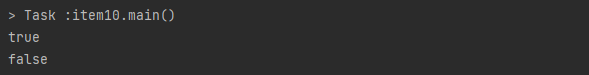
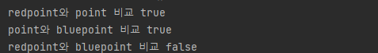

# Effective Java 3장 모든 객체의 공통 메소드


## Item 10. equals는 일반 규약을 지켜 재정의하라

equals 메소드는 일부 다른 개체가 이 개체와 "동일한"지 여부를 나타내는 메소드이다.

> https://docs.oracle.com/javase/7/docs/api/java/lang/Object.html

equals 메소드는 재정의하기 쉬워보이지만 종종 발생하는 문제점이 있다.


### equals를 재정의하면 안되는 경우

#### 각 인스턴스가 본질적으로 고유할 경우

* `Thread`와 같이 값을 표현하는 게 아닌 동작하는 개체를 표현하는 클래스일 경우


#### 인스턴스의 논리적 동치성을 검사할 일이 없을 경우

논리적 동치(Logical Equivalence) : 두 문장이나 수식이 논리적으로 같다는 의미를 뜻함

* 논리적 동치성 검사의 예 : `java.util.regex.Pattern`의 `equals`


#### 상위 클래스에서 재정의한 equals가 하위 클래스에도 딱 들어맞을 경우

* 상위에서 구현한 equals 로직으로 충분한 경우 재정의하는 것이 아니라 상위 클래스의 equals를 그대로 사용
  * Set의 구현체는 AbstractSet이 구현한 equals를 상속받아 사용


#### 클래스가 private이거나 package-private이고 equals를 호출할 일이 없을 경우

* equals가 실수로라도 호출되는 걸 막고 싶을 땐 아래와 같이 구현한다.

* ```java
  @Override public boolean equals(Object o) {
      throw new AssertionError();
  }
  ```


### equals의 재정의가 필요한 경우


#### 객체 식별성(두 객체가 물리적으로 같은 지)이 아니라 논리적 동치성(두 객체가 논리적으로 같은 지)이 필요한 경우

주로 두 객체가 같은지가 아니라 값이 같은지를 알기 위한 값 클래스가 여기에 포함된다.

###### 	※ 값 클래스 : Integer, String과 같이 값을 표현하는 클래스

Enum과 같이 값이 같은 인스턴스가 2개 이상 만들어지지 않는다는 보장이 되는 통제 클래스라면 equals를 재정의할 필요 없다.


#### equals 재정의 시 지켜야 하는 규약

##### 반사성(reflextivity)

객체는 자신과 같아야 한다는 뜻으로 "text".equals("text") 라는 코드는 **항상 true를 반환**해야 한다.

```java
x.equlas(x) == true
```


##### 대칭성(symmetry)

* 두 객체는 서로에 대한 동치 여부에 똑같이 답해야 한다.

```java
x.equals(y) == y.equals(x)
```

```java
public final class CaseInsensitiveString {
  private final String s;

  public CaseInsensitiveString(String s) {
    this.s = Objects.requireNonNull(s);
  }

  @Override
  public boolean equals(Object o) {
    if(o instanceof CaseInsensitiveString) {
      return s.equalsIgnoreCase(((CaseInsensitiveString) o).s);
    }

    if(o instanceof String) { //한 방향으로만 작동!!
      return s.equalsIgnoreCase((String) o);
    }
    return false;
  }
}
```

위 코드를 실행해보면 대칭성이 깨지는 것을 확인할 수 있다.

```java
public class item10 {
    public static void main(String[] args) {
        CaseInsensitiveString caseInsensitiveString = new CaseInsensitiveString("Test");
        String test = "test";
        System.out.println(caseInsensitiveString.equals(test)); //true
        System.out.println(test.equals(caseInsensitiveString)); //false
    }
}
```

##### 


##### 추이성(transitivity)

 첫 번째 객체와 두 번째 객체가 같고, 두 번째 객체와 세 번째 객체가 같다면, 첫 번째 객체와 세 번째 객체도 같아야 한다는 의미

* null이 아닌 모든 참조 값 x, y, z에 대해 x.equals(y)와 y.equals(z)가 true면 x.equals(z)도 true이다. 


```java
package chap3;

public class Point {
    private final int x;
    private final int y;

    public Point(int x, int y) {
        this.x = x;
        this.y = y;
    }

    @Override
    public boolean equals(Object o) {
        if (!(o instanceof Point))
            return false;
        Point p = (Point)o;
        return p.x == x && p.y == y;
    }
}
```
```java
package chap3;

import java.awt.*;

public class ColorPoint extends Point {
    private final Color color;

    public ColorPoint(int x, int y, Color color) {
        super(x, y);
        this.color = color;
    }

    @Override
    public boolean equals(Object o) {
        if (!(o instanceof Point))
            return false;

        if (!(o instanceof ColorPoint))
            return o.equals(this);
        //Point와 비교 시 색상을 무시하고 있다.
        return super.equals(o) && ((ColorPoint) o).color == color;
    }

    public static void main(String[] args) {
        ColorPoint redPoint = new ColorPoint(1, 2, Color.RED);
        Point point = new Point(1, 2);
        ColorPoint bluePoint = new ColorPoint(1, 2, Color.BLUE);

        System.out.println("redpoint와 point 비교 " + redPoint.equals(point)); //true
        System.out.println("point와 bluepoint 비교 " + point.equals(bluePoint)); //true
        System.out.println("redpoint와 bluepoint 비교 " + redPoint.equals(bluePoint)); //false
    }
}
```

이 코드를 실행 한 결과는 아래와 같다.

##### 

redPoint와 point와의 비교에서, 그리고 point와 bluePoint와의 비교는 색상을 무시했지만, redPoint와 bluePoint와의 비교에서는 색상을 고려했기 때문에 추이성이 깨진 것을 알 수 있다. 이러한 문제는 무한재귀에 빠질 수 있기에 조심해야 한다. 

추이성에 위배되는 문제를 지키기 위한 대안은 상속 대신 **컴포지션을 사용**하는 것이 있다. Point를 상속하는 대신 Point 객체를 필드로 만든 뒤 Point 뷰 메소드를 만드는 방법이다. 코드는 아래와 같다.

```java
public class ColorPointFromComposition {
    private final Point point;
    private final Color color;

    public ColorPointFromComposition(int x, int y, Color color) {
        this.point = new Point(x, y);
        this.color = color;
    }

    public Point asPoint() {
        return point;
    }

    @Override
    public boolean equals(Object o) {
        if(!(o instanceof ColorPointFromComposition))return false;
        ColorPointFromComposition cp = (ColorPointFromComposition) o;
        return cp.point.equals(point) && cp.color.equals(color);
    }
}
```


##### 일관성(constistency)

* null이 아닌 모든 참조 값 x, y에 대해 x.equals(y)를 반복해서 호출하면 항상 같은 값을 반환해야 한다. 만약 클래스를 불변으로 만들었다면 equals에서 나온 결과가 계속 같은 값을 반환해야 한다. 클래스가 반환 결과에 신뢰할 수 없는 자원이 들어가선 안된다. ex) ip 주소


##### nullable

* null이 아닌 모든 참조 값 x에 대해서, x.equals(null)은 false여야 한다.
* true만 반환하지 않으면 된다는게 아니라 NullPointerException도 발생시켜서는 안된다.


### equals 메소드 구현방법

1. ##### == 연산자를 사용해 입력이 자기 자신의 참조인지(반사성) 확인

   * 자기자신이면 true를 반환하여 성능 최적화를 할 수 있도록 함

2. ##### instanceof 연산자로 입력이 올바른 타입인지 확인

3. ##### 입력을 올바른 타입으로 형변환

4. ##### 입력 객체와 자기 자신의 대응되는 핵심필드들이 모두 일치하는지 하나씩 검사

5. ##### equals를 재정의할 땐 hashCode도 반드시 재정의


---


## Item 11. equals를 재정의 하려거든 hashCode도 재정의하라

##### equals : 두 객체의 내용이 같은지, 동등성(equality)를 비교하는 메소드

##### hashCode : 두 객체가 같은 객체인지, 동일성(identity)를 비교하는 메소드


#### Object 명세에서 발췌한 HashCode 규약

1. 애플리케이션이 유지되는 동안 equals비교에 사용되는 정보가 변경되지 않았다면, 몇 번을 호출하더라도 일관된 값을 반환해야 한다.
2. equals(Object)가 동일하다고 판단되면 두 객체의 hashCode는 동일한 값을 반환해야 한다.
3. equals(Object)가 동일하지 않다고 판단하더라도 hashCode가 서로 다른 값을 반환할 필요는 없다.  하지만, 다른 값을 반환해야 해시테이블의 성능이 좋아진다.


```java
public static void main(String[] args) {
	Map<PhoneNumber, String> m = new HashMap<>();
	m.put(new PhoneNumber(707, 867, 5309), "Jenny");

	System.out.println(m.get(new PhoneNumber(707, 867, 5309)));
}
```

책에 나온 예시 사례이다. 이 코드는 Jenny라는 값이 반환될거라는 기대가 있지만 실제로는 `null`이 반환된다. 여기서 HashMap에 Jenny를 넣을 때와 이것을 꺼내려할 때 총 2번의 PhoneNumber 인스턴스가 사용되었기 때문이다. 이러한 문제를 해결하려면 PhoneNumber에 대해서 적절한 hashCode를 작성해주면 해결이 가능하다.


##### 사용해서는 안되는 방법

```java
@Override public int hashCode() { 
    return 42; 
}
```

위 코드대로 사용하게 되면 모든 객체가 해시테이블의 버킷 하나에 담겨 LinkedList 처럼 동작하게 된다. 그렇게 되면 평균 수행 시간이 O(1)인 해시테이블의 성능이 O(n)으로 느려져서 객체가 많아지면 쓸 수 없게 된다.

좋은 해시 함수라면 세번 째 규약에서 말하듯이 서로 다른 인스턴스에 다른 해시코드를 반환해야 한다. 


#### 좋은 hashCode 를 작성하는 간단한 요령

1. int 변수 reult 를 선언 한 후 값 c로 초기화 한다. (이때 c는 해당 객체의 첫번째 핵심 필드를 2.a단계 방식으로 계산한 hashCode)

2. 해당 객체의 나머지 핵심필드 f 각각에 대해 다음 작업을 수행

   a. 해당 필드의 해시코드 c를 계산

   1. 기본 타입 필드라면, Type.hashCode(f)를 수행
   2. 참조 타입 필드면서 이 클래스의 equals 메소드가 이 필드의 equals를 재귀적으로 호출해 비교한다면, 이 필드의 hashCode 를 재귀적으로 호출
      * 계산이 더 복잡해질 것 같으면, 이 필드의 표준형을 만들어 그 표준형의 hashCode를 호출하고, 이 때  필드의 값이 null이면 일반적으로 0을 사용
   3. 필드가 배열이라면, 핵심 원소 각각을 별도 필드처럼 다룬다. 이상의 규칙을 재귀적으로 적용해 각 핵심 원소의 해시코드를 계산한 다음, 2.b단계 방식으로 갱신한다. 배열에 핵심 원소가 하나도 없다면 단순히 상수(0을 추천)를 사용한다. 모든 원소가 핵심 원소라면 Arrays.hashCode를 사용한다.

   b. 2.a 단계에서 계산한 해시코드 c 로 result 를 갱신한다.

   $result = 31 * result + c;$

3. result 를 반환


##### ※ 위에 해쉬코드를 작성하는 요령에서 31이라는 숫자가 무심코 나왔는데 이는 31이  홀수이면서 소수이기 때문이다.

- 곱할 숫자가 짝수고 오버플로가 발생하면 정보를 잃게되기 때문
  - 2를 곱하면 시프트 연산과 같은 결과를 줌
- 소수를 곱하는 것은 전통적으로 나머지 연산에서 충돌을 줄이기 위한 방법으로 주로 사용되는 방식이다.
- 31을 곱하는 것은 시프트 연산과 뺄셈으로 대체해 최적화 할 수 있다.
  - $31*i$와 $(i<<5)-i$는 같은 뜻으로 사용된다.


```java
@Override public int hashCode() {
	int result = Short.hashCode(areaCode);
	result = 31 * result + Short.hashCode(prefix);
	result = 31 * result + Short.hashCode(lineNum);
	return result;
}

public static void main(String[] args) {
	Map<PhoneNumber, String> m = new HashMap<>();
	m.put(new PhoneNumber(707, 867, 5309), "Jenny");

	System.out.println(m.get(new PhoneNumber(707, 867, 5309)));
}
```


추가적으로 해시 충돌이 더욱 적은 방법을 사용하기 위해서는 `com.google.common.hash.Hashing`을 참고하면 된다.

>https://guava.dev/releases/21.0/api/docs/com/google/common/hash/Hashing.html


Object 클래스는 `hash` 라는 임의의 개수만큼 객체를 받아 해시코드로 계산해주는 메소드를 제공한다.

* 입력 인수를 담기 위한 배열을 만들고, 박싱/언박싱을 거쳐야 하기 때문에 속도는 조금 느리다.


클래스가 불변이고 hashCode를 계산하는 비용이 크다면 `캐싱` 고려하는 것이 좋다. 클래스의 객체가 주로 해시의 키로 사용된다면 인스턴스가 생성될 때 해시코드 계산해야 한다. 해시 키로 사용되지 않으면 hashCode가 처음 불릴 때 계산하는 전략을 사용한다.(지연 초기화 전략)


```java
private int hashCode;

@Override public int hashCode() {
	int result = hashCode;
	if(result == 0){
		result = Short.hashCode(areaCode);
		result = 31 * result + Short.hashCode(prefix);
		result = 31 * result + Short.hashCode(lineNum);
		hashCode = result;
	}
	return result;
}
```

시스템의 성능을 높이기 위해서 해시코드 계산시에 핵심 필드를 생략하면 안된다. 이는 속도가 빨라질 수도 있지만 해시의 품질을 떨어뜨려 더 심각한 성능 문제를 만들 수 있다.

또한 hashCode가 반환하는 값의 생성 규칙에 대해서 API 사용자에게 자세히 알리지 않아야 추후 결함이나 기능개선을 위해 계산 방식을 바꿀 일이 생길 때 수정이 가능하다.


---


## Item 12. toString을 항상 재정의하라.

toString 메소드의 일반 규약은 **간결하면서 사람이 읽기 쉬운 형태의 유익한 정보를 반환**해야 한다. 하지만 우리가 확인 가능한 것은 클래스이름과 16진수로 표현된 해시코드 뿐이다. 

우리는 toString을 재정의하여 디버깅 및 정보 가시성을 높여야 한다.

toString을 재정의 할 때는 **객체 스스로를 완벽히 설명하는 문자열**이어야 하고, **객체가 가진 주요 정보를 모두 반환**하는 것이 좋다.

포맷이 정해져 있는 경우, 재정의하고 주석을 달아서 문서화를 해주면 더욱 정보를 보기 쉽다.

```java
/**
* 이 전화번호의 문자열 표현을 반환한다.
* 이 문자열은 "XXX-YYY-ZZZZ" 형태의 12글자로 구성된다.
* XXX는 지역 코드, YYY는 프리픽스, ZZZZ는 가입자 번호다.
* 각각의 대문자는 10진수 숫자 하나를 나타낸다.
*
* 전화번호의 각 부분의 값이 너무 작아서 자릿수를 채울 수 없다면,
* 앞에서부터 0으로 채워나간다. 예컨대 가입자 번호가 123이라면
* 전화번호의 마짐가 네 문자는 "0123"이 된다.
*/
@Override
public String toString() {
	return String.format("%3d-%03d-%04d", areaCode, prefix, lineNum);
}
```

포맷이 정해지지 않더라도 대략적인 설명을 주석으로 명시하면 좋다.

```java
/**
* 이 약물에 관한 대략적인 설명을 반환한다.
* 다음은 이 설명의 일반적인 형태이나,
* 상세 형식은 정해지지 않았으며 향후 변경될 수 있다.
*
* "[약물 #9: 유형=사랑, 냄새=테레빈유, 겉모습=먹물]"
*/
@Override
public String toString() { ... }
```

toString 반환값 문서화을 문서화할 때는 의도를 명확히 밝혀야 한다. 또한 포맷 명시 여부와 상관없이 toString이 반환값에 포함된 정보를 얻어올 수 있는 API를 제공해야 하는데 포맷을 문서화 했을 경우 그 값을 **그대로 입출력에 사용**하거나 **사람이 읽을 수 있는 데이터 객체로 저장**할 수 있다.


toString을 항상 재정의해야 하는 것은 아니다. 정적 유틸리티 클래스는 toString을 제공할 이유가 없고, 대부분의 열거 타입도 자바가 이미 완벽한 toString을 제공하니 따로 재정의 할 필요가 없다. 하지만 하위 클래스들이 공유해야 할 문자열 표현이 있는 추상 클래스라면 toString을 재정의해줘야 한다.

각 클래스가 가진 데이터에 따라 자동 생성 toString이 적합할 수도 있고 그렇지 않을 수도 있지만 객체의 값에 관해 알려주지 않는 Object의 toString 보다는 자동 생성된 toString이 훨씬 유용하기 때문에 재정의 하는 편이 좋다.


---


## Item 13. clone 재정의는 주의해서 진행하라

##### Cloneable

* 복제해도 되는 클래스임을 명시하는 믹스인 인터페이스(mixin interface)

객체를 복사하고싶다면 Cloneable 인터페이스를 구현해 clone 메소드를 재정의하는 방법이 일반적이지만, clone 메소드는 Cloneable이 아니라 Object에 선언되어 있고, protected 접근제어자로 되어 있어 같은 패키지가 아니면 접근할 수 없다. 따라서 Cloneable 인터페이스를 구현하는 것 만으로는 clone 메소드 호출이 안된다. 


#### Cloneable의 역할

Object 클래스의 protected로 선언되어있는 clone 메소드의 동작 방식을 결정한다. clone을 호출하면 객체의 필드들을 복사한 객체를 반환한다.

* Cloneable을 구현하지 않은 클래스에서 clone을 호출하면 `CloneNotSupportedException`이 발생한다.


#### clone 메소드의 일반 규약

```java
1. x.clone() != x //True
2. x.clone().getClass() == x.getClass() //True
3. x.clone.equals(x) //True
4. x.clone().getClass() == x.getClass()
```

1.에서 보듯이 복사본이 원본과 일치하지 않지만 2. 클래스 인스턴스는 같은 타입이고, 그 밑에 있는 3. 수식도 참이지만 필수는 아니다.

clone() 메소드의 반환값이 복사될 객체를 가르키기에 강제성이 빠진 `생성자 연쇄(constructor chaining)`와 유사한데 clone 내부 로직이 생성자를 호출해 얻은 인스턴스를 반환해도 문제가 없다는 것을 뜻한다. 하지만 이렇게 되면 해당 클래스의 하위클래스에서 super.clone()으로 호출할 때 상위 객체에서 잘못된 클래스가 생성될 수 있기에 위험하다.

* 상위 클래스의 clone() 값을 반환하면 안되고, 하위 클래스 타입으로 변환한 뒤 반환해야 한다.
* clone() 을 재정의한 클래스가 final 클래스인 경우에는 하위 클래스가 없기 때문에 안전하다.


모든 필드가 기본 타입이거나 불변 객체를 참조하는 경우 이 객체는 완벽한 상태이므로 clone()를 제공하지 않는 것이 좋다.

- 쓸데 없는 복사를 지양한다는 관점에서 불변 클래스는 굳이 clone 메소드를 제공하지 않는 것이 좋다.


```java
@Override
public PhoneNumber clone() {
    try {
        return (PhoneNumber) super.clone();
    } catch (CloneNotSupportedException e) {
        throw new AssertionError();
    }
}
```

- 자바에서는 `공변 반환 타이핑`을 지원하기 때문에 재정의한 메소드의 반환 타입은 상위 클래스의 메소드가 반환하는 타입의 하위 타입일 수 있다.

  ###### 	공변반환 타이핑 : 메소드가 오버라이딩될 때 더 좁은 타입으로 교체할 수 있다는 것

- 클라이언트가 형변환 하지 않도록 인터페이스를 제공한다.

- 위 예시 코드에서 try-catch로 super.clone을 감쌌는데 이는 Object의 clone 메소드가 **검사 예외(checked exception)** 로 제공되는 것을 **비검사 예외(unchecked exception)** 로 처리하도록 한다.


#### 가변 객체를 참조하는 경우

```java
public class Stack {
    private Object[] elements;
    private int size = 0;
    private static final int DEFAULT_INITIAL_CAPACITY = 16;

    public Stack() {
        this.elements = new Object[DEFAULT_INITIAL_CAPACITY];
    }

    public void push(Object e) {
        ensureCapacity();
        elements[size++] = e;
    }

    public Object pop() {
        if (size == 0)
            throw new EmptyStackException();
        Object result = elements[--size];
        elements[size] = null;
        return result;
    }

    private void ensureCapacity() {
        if (elements.length == size) {
            elements = Arrays.copyOf(elements, 2 * size + 1);
        }
    }
}
```

이 클래스를 복제하기 위해서 clone이 super.clone을 그대로 반환하게되면 stack인스턴스의 size는 같은 필드 값을 가지게 되겠지만, elements의 경우 원본과 같은 배열을 참조한다. 따라서 **원본 데이터가 변경되는 경우 같이 수정된다.** 

clone 메소드는 사실상 생성자와 같은 효과를 낸기에 원본 객체에 아무런 해를 끼치지 않는 동시에 복제된 객체의 불변식을 보장해야 한다. 따라서 이런 가변적인 값을 가지고 있을 때 제대로 동작하게 만들기 위해서는 스택 내부 정보를 복사해야 한다. 이 예시에서는 elements 배열의 clone을 재귀로 호출하는 방법을 사용한다.

```java
@Override
public Stack clone() {
    try {
        Stack clone = (Stack) super.clone();
        clone.elements = elements.clone();
        return clone;
    } catch(CloneNotSupportedException e) {
        throw new AssertionError();
    }
}
```

배열의 clone은 런타임 타입과 컴파일 타입 모두가 원본 배열과 같은 배열을 반환

* 배열을 복제할 때는 배열의 clone 메소드를 사용하라고 권장한다.
* 배열은 clone 기능을 제대로 사용하는 유일한 예

elements 필드가 final인 경우에는 새로운 값을 할당 불가능하기 때문에 사용할 수 없다.

* 복제 가능한 클래스를 위해 final 한정자를 제거해야 하는 경우도 있다.


또한 Hash테이블에서의 clone메소드의 경우에서도 문제가 발생한다.

```java
@Override
public HashTable clone() {
    try {
        HashTable result = (HashTable) super.clone();
        result.buckets = buckets.clone();
        return result;
    } catch(CloneNotSupportedException e){
        throw new AssertionError();
    }
}
```

여기서 우리가 복제하고자 하는 복제본은 자기 사진의 버킷 배열을 가지게 되지만 원본과 같은 연결 리스트를 참고하기 때문에 원본과 복제본 둘 다 예기치 않게 동작 할 수 있다.

* 이는 각 버킷을 구성하는 연결리스트를 복사하면 된다.

이 방법을 위해 HashTable.Entry는 `깊은복사(Deep copy)`를 지원하도록 보강되었다.

* 이 방식 또한 재귀 호출 때문에 리스트의 원소 수 만큼 스택 프레임을 사용하여 리스트가 긴 경우에는 스택오버플로를 일으킬 위험이 있다.


#### 복잡한 가변 객체를 복제하는 방법

super.clone() 을 호출하여 얻은 객체의 **모든 필드를 초기 상태로 설정**한다. 이후 원본 객체의 상태를 다시 생성하는 **고수준 메소드들을 호출**한다. 하지만 이 방법은 저수준에서 바로 처리할 때보다는 느리고, Cloneable 아키텍처의 기초가 되는 필드 단위 객체 복사를 우회하기 때문에 전체 Cloneable 아키텍처와는 어울리지 않는 방식이다.


#### clone() 메소드 재정의 시 주의사항

- clone() 메소드는 CloneNotSupportedException을 던진다고 선언되어 있지만 재정의한 메소드는 수정해야 한다.
- public clone 메소드에서는 throws 절을 없애야 한다.
  - 검사 예외를 비검사예외로 수정해야 그 메소드를 사용하기에 편리하기 때문


#### 복사 생성자와 복사 팩토리(변환 생성자와 변환 팩토리)

이미 Cloneable을 구현한 클래스는 어쩔 수 없지만 그게 아니라면 복사 생성자와 복사 팩토리라는 객체 복사 방식을 고려할만 하다. 

##### cloneable/clone 방식에 비해 좋은 점

* 언어 모순적이고 생성자를 쓰지않는 객체 생성 메커니즘을 사용하지 않는다.

* 정상적인 final 필드 용법과도 충돌하지 않는다.

* 불필요한 예외가 발생하지 않는다.

* 형변환도 필요하지 않다. 

* 해당 클래스가 구현한 '인터페이스'타입의 인스턴스를 인수로 받을 수 있다.

  ex : HashSet을 TreSet 타입으로 복제할 수 있다. 


---


## Item 14. Comparable을 구현할지 고려하라


객체에서 정렬이 필요할 때 Comparator, Comparable 인터페이스를 많이 사용한다.  

##### Comparable: 인터페이스를 구현한 객체 스스로에게 부여하는 한 가지 기본 정렬 규칙을 설정

##### Comparator: 인터페이스를 구현한 클래스는 정렬 규칙 그 자체. 기본 정렬 규칙과는 다르게 사용자가 원하는대로 정렬 순서를 지정

Comparable 인터페이스는 `compareTo`라는 메소드를 정의하는데, 이 메소드는 Object 메소드가 아니다. 

* 성격은 Object의 equals와 유사한데, 동치성 비교뿐만 아니라 **순서까지 비교가 가능**하고 **제네릭**하다는 차이점이 있다. 

자바에서 제공하는 모든 값 클래스와 열거 타입이 Comparable을 구현했기 때문에 알파벳, 숫자, 번호등 순서가 있는 값 클래스를 만들 때 Comparable 를 구현해야 한다.


##### 정렬과 관련된 다른 클래스들

- HashSet
  - 데이터를 중복 저장할 수 없고, 순서를 보장하지 않음
- TreeSet
  - 중복된 데이터를 저장할 수 없고, 입력한 순서대로 값을 저장하지 않음
  - TreeSet은 기본적으로 오름차순으로 데이터를 정렬
- LinkedHashSet
  - 중복된 데이터를 저장할 수 없고, 입력된 순서대로 데이터를 관리함


#### compareTo 메소드의 일반 규약

compareTo 메소드의 일반 규약은 equals과 비슷하다.  Comparable 을 구현한 객체는 다음 규약들을 지켜야 한다. 

* ##### 해당 객체와 주어진(매개변수) 객체의 순서를 비교한다.

  * 해당 객체가 더 크다면 양수를 반환
  * 해당 객체가 더 작다면 음수를 반환
  * 해당객체와 주어진 객체가 같을경우 0을 반환 
  * 해당 객체와 비교할 수 없는 타입의 객체가 전달되면 `ClassCastException`이 발생

* ##### 대칭성을 보장

  *  모든 x, y클래스에 대해서 `sgn(x.compareTo(y) == -sgn(y.compareTo(x))`여야 한다.
  *  x.compareTo(y)는 y.compareTo(x)가 예외를 던질 때에 한해서 예외가 발생해야 한다.

* ##### 추이성을 보장

  * 객체 x, y, z가 있다고 할 때 x.compareTo(y)가 양수이고 y.compareTo(z)도 양수라면, x.compareTo(z)도 양수여야한다. (x > y && y > z 이면 x > z여야 한다.)

* x.compareTo(y) == 0 이면 sgn(x.compareTo(z)) == sgn(y.compareTo(z)) 이어야 한다.
* x.compareTo(y) == 0 이면 x.equals(y)어야 한다.
  *  이 규약은 필수적인 규악은 아니지만 지키는 것이 좋다.


#### equals 규약과의 차이점

대칭성, 추이성, 반사성 규약은 equals와 같아보이지만 모든 객체에 대해 전역 동치관계를 부여하는 equals와 다르게 compareTo는 **타입이 다른 객체를 신경쓰지 않고**, 다른 객체가 있는 경우 `ClassCastException`을 던지면 된다.


#### compareTo의 작성 요령

equals와 비슷하지만, Comparable은 타입을 인수로 받는 제네릭 인터페이스라서 compareTo 메소드의 인수 타입은 컴파일타임에 정해진다. 따라서 입력 인수의 타입을 확인하거나 형 변환 할 필요가 없다. 만약 인수 타입이 잘못되면 컴파일이 되지 않고,  null을 인수로 넣으면 NPE을 던져야 한다.


##### 작성 요령

* 각 필드의 동치관계를 보는게 아니라 그 **순서**를 비교한다. 
* 객체 참조 필드를 비교하려면 compareTo 메소드를 **재귀적으로 호출**한다. 
* Comparable을 구현하지 않은 필드나 표준이 아닌 순서로 비교해야 할 경우 Comparator를 쓰면 된다. 


##### 참조 필드가 하나인 사용 예시

```java
public final class CaseInsensitiveString implements Comparable<CaseInsensitiveString> {
    public int compareTo(CaseInsensitiveString cis) {
        return String.CASE_INSENSITIVE_ORDER.compare(s, cis.s);
    }
}
```

자바 7 버전 이후부터는 박싱된 기본 타입 클래스들에 compare를 이용하는 것이 가능하다. compareTo를 이용할 때 부등호를 이용하는 것에서 오류가 많이 생기기 때문에 이러한 방법을 사용한다.


##### 참조 필드가 여러 개인 사용 예시

```java
public int compareTo(PhoneNumber pn) {
    int result = Short.compare(areaCode, pn.areaCode);
    if(result == 0) {
        result = Short.compare(prefix, pn.prefix);
        if(result == 0) {
            result = Short.compare(lineNum, pn.lineNum);
        }
    }
    return result;
}
```


자바 8 에서는 Comparator 인터페이스가 비교자 생성 매서드와 함께 메소드 연쇄 방식으로 비교자를 생성할 수 있게 되었다.


```java
public static final Comparator<PhoneNumber> COMPARATOR = 
        comparingInt((PhoneNumber pn) -> pn.areaCode)
        .thenComparingInt(pn -> pn.prefix)
        .thenComparingInt(pn -> pn.lineNum);

public int compareTo(PhoneNumber pn) {
    return COMPARATOR.compare(this, pn);
}
```

이 코드는 클래스 초기화시 비교자 생성 메소드 2개를 이용해 비교자를 생성한다.

최초의 comparingInt에서는 객체 참조를 int 타입 키에 매핑하는 키 추출 함수를 인수로 받아 해당 키를 기준으로 순서를 정하는 비교자를 반환하는 정적 메소드다. 여기서 키를 받아 순서를 정하는 비교자를 반환하도록 한다. 위 예시에서는 areaCode가 기준이 된다.

areaCode가 같은 경우가 있을 수 있기에 thenComparingInt를 통해서 추가적인 비교자 반환을 하도록 한다.


객체 간 순서를 정한다고 해시코드를 기준으로 정렬하기도 하는데 단순히 첫 번째 값이 크면 양수, 같으면 0, 첫 번째 값이 작으면 음수를 반환한다는 것만 생각해서 아래와 같이 작성을 해선 안된다.


```java
static Comparator<Object> hashCodeOrder = new Comparator<>() {
    public int compare(Object o1, Object o2) {
        return o1.hashCode() - o2.hashCode();
    }
};
```


이 방식은 정수 오버플로 혹은 IEEE754 부동소수점 계산 방식에 따른 오류를 낼 수 있고, 속도 이슈도 존재한다. 만약 사용해야 하는 경우 정적 compare 메소드 혹은 비교자 생성 메소드를 사용해야 한다.


```java
static Comparator<Object> hashCodeOrder = new Comparator<>() {//정적 compare 메소드
    @Override
    public int compare(Object o1, Object o2) {
        return Integer.compare(o1.hashCode(), o2.hashCode());
    }
};

static Comparator<Object> hashCodeOrder = //비교자 생성 메소드
    Comparator.comparingInt(o -> o.hashCode());
```