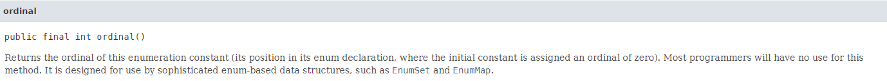

# Effective Java 5장 열거 타입과 애너테이션


## Item 34. int 상수 대신 열거 타입을 사용하라.


### 열거 타입

일정 개수의 상수를 정의한 다음 그 외의 값은 허용하지 않는 타입


#### 정수 열거 패턴의 단점

##### 타입 안전을 보장할 방법이 없고 표현력이 좋지 않다.

* 메소드에 잘못된 값을 보내더라도 컴파일러는 경고 메세지를 출력하지 않는다.


##### 정수 열거 패턴을 사용하는 프로그램은 깨지기 쉽다.

* 컴파일하면 그 값이 그대로 클라이언트 파일에 새겨지기 때문에 값이 바뀌는 경우 재컴파일을 해야 한다.


##### 정수 상수는 문자열로 출력하기 다소 까다롭다.

* 출력 또는 디버거로 확인해보면 의미가 아닌 숫자로 보여서 도움이 되지 않는다.
* 문자열 열거 패턴이라는 변형을 사용하여 상수의 의미를 출력할 수는 있지만 문자열 값 그대로 하드코딩해야 하는 와중에 휴먼에러를 통한 오타를 찾기 어렵다.


이러한 열거 패턴의 단점을 없애기 위해 **열거 타입**을 제시했다.

```java
public enum Apple{
    FUJI, PIPPIN, GRANNY_SMITH
}
public enum Orange{
    NAVEL, TEMPLE, BLOOD
}
```


#### 열거 타입의 특징

* 열거 타입 자체는 클래스이다. 
* 상수 하나당 자신의 인스턴스를 하나씩 만들어 public static final 필드로 공개한다. 
  * 밖에서 접근할 수 있는 생성자를 제공하지 않기에 사실상 final이다. 
* 열거 타입 선언으로 만들어진 인스턴스들은 딱 하나씩만 존재함이 보장된다.(인스턴스 통제)
  * 싱글톤은 원소가 하나인 열거 타입이라 볼 수 있고 열거 타입은 싱글턴의 일반화이다.
* 타입 안전성을 제공한다. 
* `namespace`가 있어서 이름이 같은 상수도 공존할 수 있다. 
* 임의의 메서드나 필드를 추가할 수 있고, 임의의 인터페이스를 구현하게 할 수도 있다. 
* 열거 타입은 자신 안의 정의된 상수들의 값을 배열에 담아 반환하는 정적메서드(values)를 제공한다. 


#### 열거 타입의 사용 방안

##### 각 상수와 연관된 데이터를 상수 자체에 내재시키고 싶을 때 사용

* 실제로는 클래스이기 때문에 어떠한 메소드도 추가 가능하다.

```java
public enum Planet {
    MERCURY(3.302e+23, 2.439e6),
    VENUS(4.869e+24, 6.052e6),
    EARTH(5.975e+24, 6.378e6),
    MARS(6.419e+23, 3.393e6),
    JUPITER(1.899e+27, 7.149e7),
    SATURN(5.685e+26, 6.027e7),
    URANUS(8.683e+25, 0.556e7),
    NEPTUNE(1.024e+26, 2.477e7);

    private final double mass;              //질량(kg)
    private final double radius;            //반지름(meter)
    private final double surfaceGravity;    //표면중력(m / s^2)

    private static final double G = 6.67300E-11;	//중력상수(m^3 / kg s^2)

    Planet(double mass, double radius) {
        this.mass = mass;
        this.radius = radius;
        surfaceGravity = G * mass / (radius * radius);
    }

    public double mass() { return mass; }
    public double radius() { return radius; }
    public double surfaceGravity() { return surfaceGravity; }

    public double surfaceWeight(double mass) {
        return mass * surfaceGravity; // F = ma
    }
}
```

* 열거 타입 상수 각각을 특정 데이터와 연결지으려면 생성자에서 데이터를 받아 인스턴스 필드에 저장하면 된다.
  * 근본적으로 열거타입이 불변이므로 모든 필드는 `final`이어야 한다.
* 자신 안에 정의된 상수 값들을 배열에 담아 반환하는 정적 메소드인 `values`를 제공한다.
  * 각 열거 타입 값의 toString가 이름을 문자열로 반환하기 때문에 출력하기 좋다.


###### 정수 열거 패턴에서 문제가 되었던 하나의 상수를 제거 하는 것도 열거 타입에서는 클라이언트에 영향이 없다.

* 재컴파일시에 제거된 상수를 참조하는 줄에서 컴파일 오류가 발생해 예외처리하기 때문에 바람직한 대응이 가능하다.


##### 열거 타입을 선언한 클래스 혹은 그 패키지에서만 유용한 기능은 `private` 또는 `package-private` 메소드로 구현한다.

이렇게 구현하면 자신을 선언한 클래스 또는 패키지에서만 사용할 수 있는 기능을 담게 된다.

* 클라이언트에 노출해야 할 이유가 없으면 `private`으로 선언하고, 필요하다면 `package-private`으로 선언하는게 좋다.

널리 쓰인다면 톱레벨 클래스로 만들고, 특정 톱레벨 클래스에서만 쓰인다면 해당 클래스의 멤버 클래스로 만든다


열거 타입은 상수별로 다르게 동작하기 위해 apply라는 추상 메소드를 선언하고 자신에 맞게 재정의하는 클래스 몸체를 이용하는 `상수별 메소드 구현`을 지원한다.

```java
public enum Operation {
    PLUS {
        public double apply(double x, double y) {
            return x + y;
        }
    },
    MINUS {
        public double apply(double x, double y) {
            return x - y;
        }
    },
    TIMES {
        public double apply(double x, double y) {
            return x * y;
        }
    },
    DIVIDE {
        public double apply(double x, double y) {
            return x / y;
        }
    };

    public abstract double apply(double x, double y);
}
```

apply 메서드가 추상 메서드로 선언되어 바로 옆에 붙어있기 때문에 새로운 상수를 추가할 때 apply를 재정의하지 않으면 컴파일되지 않는다. 

이 방법으로 상수별 데이터와 혼용할수도 있다.

```java
public enum Operation {
    PLUS("+") {
        public double apply(double x, double y) {
            return x + y;
        }
    },
    MINUS("-") {
        public double apply(double x, double y) {
            return x - y;
        }
    },
    TIMES("*") {
        public double apply(double x, double y) {
            return x * y;
        }
    },
    DIVIDE("/") {
        public double apply(double x, double y) {
            return x / y;
        }
    };
    public final String symbol;

    Operation(String symbol) {
        this.symbol = symbol;
    }

    public abstract double apply(double x, double y);

    @Override
    public String toString() {
        return symbol;
    }
}
```

이러한 상수별 메소드의 경우 열거 타입 상수끼리 코드 공유가 어렵다. 관리 관점에서 여러 코드에서 사용하는 경우에는 모든 부분에 같은 처리를 해주어야 하기 때문이다. 이 경우 공통으로 사용되는 **코드를  모든 상수에 중복해서 넣는 방법**이나 **도우미 메소드로 작성 후 상수가 필요한 메소드를 호출하는 방식**으로 해결이 가능하다. 하지만 **코드가 장황해서 가독성이 떨어지고, 오류 발생 가능성이 높아진다.** 

이러한 경우 `전략`을 선택하도록 하면 된다. 책에 나온 예시로 예를 들면 잔업 수당 계산을 `private 중첩 열거 타입`으로 옮기고, PayrollDay 열거타입의 생성자에서 적당한 것을 선택하도록 하는 것이다.


```java
public enum PayrollDay {
    MONDAY(WEEKDAY), TUESDAY(WEEKDAY), 
		WEDNESDAY(WEEKDAY), THURSDAY(WEEKDAY), FRIDAY(WEEKDAY),
    SATURDAY(WEEKEND), SUNDAY(WEEKEND);

    private final PayType payType;

    PayrollDay(PayType payType) {
        this.payType = payType;
    }

    int pay(int minutesWorkd, int payRate) {
        return payType.pay(minutesWorkd, payRate);
    }

    enum PayType {
        WEEKDAY {
            @Override
            int overtimePay(int mins, int payRate) {
                return minWorked <= MINS_PER_SHIFT ? 0 : 
                	(minWorked - MINS_PER_SHIFT) * payRate / 2;
            }
        },
        WEEKEND {
            @Override
            int overtimePay(int mins, int payRate) {
                return minsWorked * payRate / 2;
            }
        };

        abstract int overtimePay(int mins, int payRate);
        private static final int MINS_PER_SHIFT = 8 * 60;

        int pay(int minsWorked, int payRate) {
            int basePay = minsWorked * payRate;
            return basePay + overtimePay(minsWorked, payRate);
        }
    }
}
```

이 방식이 switch문을 사용하는 것 보다 복잡하지만 더 **안전하고 유연한 코드를 제공**한다. 또한 switch문의 경우 열거 타입의 상수별 동작을 구현하는데는 적합하지 않기 때문에 **기존 열거타입에 상수별 동작을 혼합하는 경우에는 switch문이 더 좋은 선택이 될 수 있다.**


#### 열거 타입을 사용하는 경우

필요한 원소를 컴파일 타임에 다 알 수 있는 상수 집합이라면 사용하면 된다.

열거 타입은 상수 개수가 바이너리 수준에서 호환되도록 설계되었기 때문에 **영원히 고정 불변일 필요는 없다.**


---


## Item 35. ordinal 메서드 대신 인스턴스 필드를 사용하라.

`ordinal 메소드`는 찾고자 하는 상수가 열거 타입에서 몇 번째 위치인지를 반환하는 메소드이다. 유용하게 사용이 가능하지만 **상수 선언 순서를 바꾸는 순간 메소드가 오동작하게된다.** 또한 **값의 중간을 비워둘 수 없다**라는 단점도 존재한다.

이 문제에 대한 해결방안은 **열거 타입 상수에 연결된 값은 ordinal 메소드로 얻지 말고, 인스턴스 필드에 저장**하면된다.

Enum API 문서에 아래와 같이 명시되어있다.



> 대부분 프로그래머는 이 메소드를 쓸 일이 없다. 이 메소드는 EnumSet과 EnumMap 같이 열거 타입 기반의 범용 자료구조에 쓸 목적으로 설계되었다.
>
> https://docs.oracle.com/en/java/javase/11/docs/api/java.base/java/lang/Enum.html

